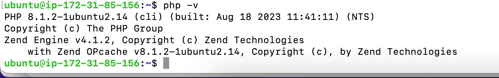
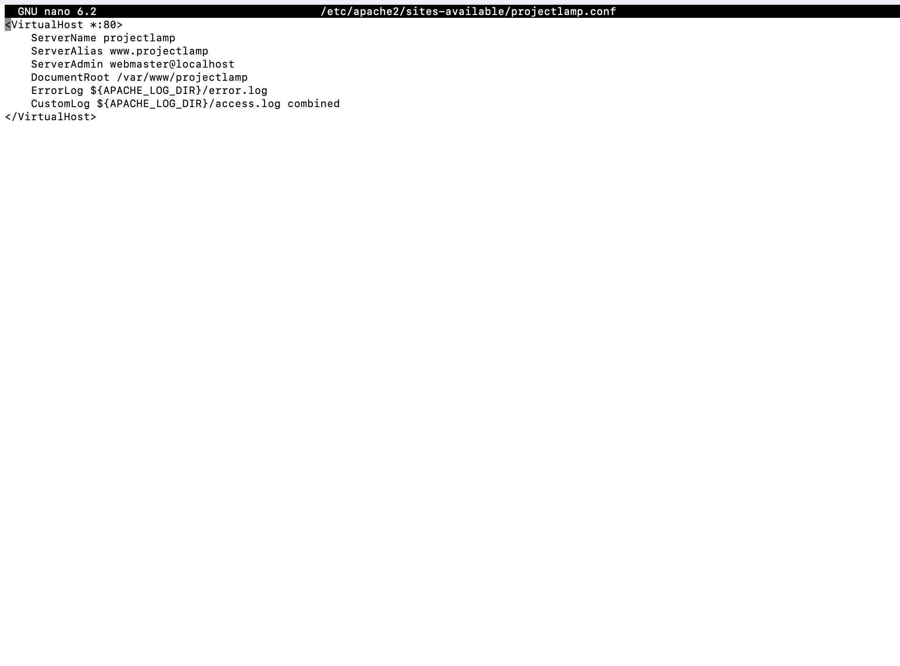

# Deployment-of-Ubuntu-Cluster-with-LAMP-Stack

**Introduction**
As a DevOps engineer, everything you do is around software, websites, applications, etc. So, different stacks of technologies make different solutions possible, called WEB STACK. Web stacks also known as software stacks or technology stacks, are used in web development to provide a cohesive set of technologies and tools for building web applications.

Examples of web stacks are listed below with their different acronyms; 
- LAMP (Linux, Apache, MySQL, PHP or Python or Perl)
- LEMP (Linux, Nginx, MySQL, PHP or Python, or Perl)
- MERN (MongoDB, ExpressJS, ReactJS, NodeJS)
- MEAN (MongoDB, ExpressJS, AngularJS, NodeJS)
For this project, we will focus on the LAMP web stack.

**Prerequisite:**

AWS account and a virtual machine with an Ubuntu server.

Spinning up a new EC2 instance (an instance of a virtual server) Click [HERE](https://medium.com/@oluchukwuedeh0/how-to-create-an-ec2-instance-on-aws-702116c4d4d5) for a step-by-step process to creating an EC2 instance in 3 mintues.

# Connecting to EC2 terminal/ Using the terminal on MAC/Linux.

The terminal is installed as a default, just open it.
- Navigate to where you downloaded your key pair on your system, with this command:

 `cd download`.

- Change premissions for the private key file (.pem)

 `chmod 400 "project-server.pem"`.

- Connect to the instance by running.

  `ssh -i "project-server.pem" ec2-user@ec2-52-23-196-199.compute-1.amazonaws.com`.
  
  

  

**Next, configure the created EC2 Instance machine to serve a web server.**

  
# Step 1: INSTALLING APACHE AND UPDATING THE FIREWALL.

Apache, also known as Apache HTTP Server, is a widely used open-source web server software. It is maintained and developed by the Apache Software Foundation, a community of developers that collaborates on various open-source projects.

Apache serves web pages and other content over the internet. Apache processes incoming requests from web clients (such as web browsers), and delivers the requested content, which includes HTML pages, images, videos, or other files.

Install Apache using Ubuntu's package manager 'apt':
  
**Update a list of packages in the package manager.**

`sudo apt update`

**Run Apache2 package installation.**

`sudo apt install apache2`

**To verify that apache2 is running as a Service in our OS, use the following command.**

`sudo systemctl status apache2`

Before we can receive any traffic from our Web Server, we need to open TCP port 80 which is the default port that web browsers use to access web pages on the Internet

As we know, we have TCP port 22 open by default on our EC2 machine to access it via SSH, so we need to add a rule to the EC2 configuration
to open an inbound connection through port 80: Open inbound port 80 - http - Anywhere from IPV4 on your security rule.

Now it is time for us to test how our Apache HTTP server can respond to requests from the Internet.

Open a web browser of your choice and try to access the following URL

http://(Public-IP-Address)

You can get your Public IP Address on the AWS EC2 console.

# STEP 2 - INSTALLING MYSQL.

We have a web server up and running, you need to install a Database Management System (DBMS) to be able to store and manage data for your website in a relational database (A relational database is a type of database that organizes data into tables, where each table represents a collection of related data entries). MySQL is a popular relational database management system used within PHP environments. Other relational databases are; PostgreSQL, Oracle Database, Microsoft SQL Server, and SQLite.

**To acquire and install this software we will be using apt.**

`sudo apt install mysql-server`

**Once installation is completed, Log in.**

`sudo mysql`

This will connect to the MySQL server as the administrative database user root. You should see output like this:

**Secure the script.**

It's recommended that you run a security script that comes pre-installed with MySQL. This script will remove some insecure default settings and lock down access to your database system. Before running the script you will set a password for the root user, using mysql_native_password as the default authentication method. We're defining this user's password as PassWord.1.

`ALTER USER 'root'@'localhost' IDENTIFIED WITH mysql_native_password BY 'PassWORD.1';`

**Exit the MySQL shell with:**

`exit`

**Start the interactive script by running:**

`sudo mysql_secure_installation`

This will ask if you want to configure the VALIDATE PASSWORD PLUGIN.
**Press 'N'**

For the rest of the questions, press Y and hit the ENTER key at each prompt. This will prompt you to change the root password,
remove some anonymous users and the test database, disable remote root logins, and load these new rules so that MySQL immediately respects the changes you have made.

**When you're finished, test if you're able to log in to the MySQL console by typing and exit:**

`sudo mysql -p`

`exit`

# STEP 3 - INSTALLING PHP.

You have Apache installed to serve your content and MySQL installed to store and manage your data. PHP is the component of our setup that will process code to display dynamic content to the end user. In addition to the PHP package, you'll need php-mysql, a PHP module that allows PHP to communicate with MySQL-based databases. You'll also need libapache2-mod-php to enable Apache to handle PHP files.
Core PHP packages will automatically be installed as dependencies.

**To install these 3 packages at once, run:**

`sudo apt install php libapache2-mod-php php-mysql`

**Confirm the version.**

`php -v`

# STEP 4 - CREATE A VIRTUAL HOST FOR YOUR WEBSITE USING APACHE.

**Set your domain name.**

Apache on Ubuntu 20.04 has one server block enabled by default that is configured to serve documents from the /var/www/html directory. We will leave this configuration as is and will add our directory next to the default one.

**Create the directory for projectlamp using the 'mkdir' command as follows:**

`sudo mkdir /var/www/projectlamp`

**Next, assign ownership of the directory to your current system user:**

`sudo chown -R $USER:$USER /var/www/projectlamp`

**create and open a new configuration file in Apache's sites available using 'nano'.**

`sudo nano /etc/apache2/sites-available/projectlamp.conf`

This will create a new blank file. Paste in the following bare-bones configuration:

<VirtualHost *:80>

    ServerName projectlamp
    
    ServerAlias www.projectlamp 
    
    ServerAdmin webmaster@localhost
    
    DocumentRoot /var/www/projectlamp
    
    ErrorLog ${APACHE_LOG_DIR}/error.log
    
    CustomLog ${APACHE_LOG_DIR}/access.log combined
    
 </VirtualHost>
 

**Use the ls command to show the new file in the sites-available directory.**

`sudo ls /etc/apache2/sites-available`

**The outcome;**

000-default.conf  default-ssl.conf  projectlamp.conf

**Input the a2ensite command to enable the new virtual host:**

`sudo a2ensite projectlamp`

**Disable the default website;**

`sudo a2dissite 000-default`

**To check syntax errors;**

`sudo apache2ctl configtest`

**Reload apache;**

`sudo systemctl reload apache2`

Now, write into the web root directory file by creating an index.html file and write the below command;

`sudo echo 'Hello LAMP from hostname' $(curl -s http://18.233.160.211/latest/meta-date public-hostname) 'with public IP' $(curl -s http://18.233.160.211/latest/meta-date/public-ipv4)> /var/www/projectlamp.index.html`

I also edited some content on the index.html using the below command;

`nano index.html`

Now go to your browser and try to open your website URL using the IP address:

http://18.233.160.211:80

# STEP 5 - ENABLE PHP ON THE WEBSITE.

By default, Apache prioritizes the index.html file over index.php in the DirectoryIndex settings. This setup is beneficial for deploying maintenance pages within PHP applications. By temporarily creating an index.html file with informative content for visitors, it becomes the default landing page due to its precedence over index.php. After completing maintenance tasks, simply renaming or removing the index.html file from the document root restores the regular application page.

To alter this behavior, you must adjust the order of files listed in the DirectoryIndex directive within the /etc/apache2/mods-enabled/dir.conf file.

`sudo nano /etc/apache2/mods-enabled/dir.conf`

<IfModule mod_dir.c>
 
#Change this:

#DirectoryIndex index.html index.cgi index.pl index.php index.xhtml index.htm
#To this:

DirectoryIndex index.php index.html index.cgi index.pl index.xhtml index.htm

</IfModule>

Save and close the file, then reload;

`sudo systemctl reload apache2`

Finally, create a PHP script to test that PHP is correctly installed and configured on your server.

Now, that we have a custom location to host your website's files and folders, we'll create a PHP test script to confirm that Apache can handle and process requests for PHP files.

Create a new file named index.php inside your custom web root folder:

`nano /var/www/projectlamp/index.php`

Paste the below instructions on it;

<?php

phpinfo();

Once done save the changes (ctrl + O) "Enter" and close the file (ctrl + X).

Refresh your browser and you will see the below page on display.

Congratulations, you made it this far. Deployed a LAMP stack website in AWS Cloud!!!

Conclusion:

The LAMP stack has stood the test of time as a reliable and versatile foundation for web development. Its combination of Linux, Apache, MySQL, and PHP/Python/Perl offers a powerful platform for building scalable, high-performance web applications. While alternative stacks have emerged, the LAMP stack remains a popular choice among developers, a testament to its enduring relevance in the ever-evolving landscape of web development.
